# インフラ開発ガイド

---

## 構成

- 導入部
- 概要
- インストール　
- 設定
- プロビジョニング
- デプロイ
- 高可用性
- スケーラビリティ
- パフォーマンス
- ネットワーク
- セキュリティ
- メトリクス
- ログ
- データバックアップ
- コスト最適化
- ドキュメント化
- テスト
- 参考
 
---

## 導入部

インフラの概要、目的、主な機能について説明します。

---

### 概要

インフラ開発において主要な活動を以下のように定義します。

要件では、アプリケーションの機能や性能、品質、セキュリティ、運用、保守などの要件をまとめる活動を行います。開発では要件を満たすための設計、実装、テストなどの活動を行います。運用では、アプリケーションの運用、保守、改善などの活動を行います。構築では、アプリケーションの環境設定を行います。配置では、アプリケーションのビルドとデプロイを行います。これらの活動は相互に影響し合い、連携して行われるため、それぞれの活動において、開発者が守るべき規則やガイドラインをまとめたドキュメントを参照してください。

---

### インストール　

ソフトウェアバイナリとその依存関係のインストール

---
### 設定 

ソフトウェア実行時の設定。ポート設定、TLS証明書、サービスディスカバリ、リーダ、フォロワ、レプリケーションなど

---
### プロビジョニング　

インフラのプロビジョニング。サーバ、ロードバランサ、ネットワーク設定、ファイアウォール設定、IAMパーミッションなど

---

### デプロイ

インフラへのサービスのデプロイ。ダウンタイムなしでの更新の展開。ブルーグリーンデプロイ、ローリングデプロイ、カナリアデプロイなど

---
### 高可用性 

各プロセス、サーバ、サービス、データセンタ、リージョンの障害への対抗

---
### スケーラビリティ 
負荷に対するスケールアップとスケールダウン。水平スケール（サーバーを増やす）と垂直スケール（サーバを大きくする）

---
### パフォーマンス 

CPU、メモリ、ディスク、ネットワーク、GPUの使用の最適化。クエリチューニング、ベンチマーク、負荷テスト、プロファイリング

---
### ネットワーク 

静的または動的なIPアドレス、ポート、サービスディスカバリ、ファイアウォール、DNS、SSHアクセス、VPNアクセスの設定

---
### セキュリティ 

通信時（TLS）およびディスク上の暗号化、認証、認可、シークレット管理、サーバハードにング

---
### メトリクス 

可用性メトリクス、ビジネスメトリクス、アプリケーションメトリクス、サーバメトリクス、イベント、オブサーバビリティ、トレーシング、アラート

---
### ログ 

ディスク上でのログローテート。ログデータの１箇所への集約

---
### データバックアップ 

DB,キャッシュなどの定期的なバックアップ。別リージョンやアカウントへの複製

---
### コスト最適化 

正しいインスタンスタイプの選択、スポットインスタンスやリザーブドインスタンスの使用、オートスケールの使用、使用していないリソースの削除

---
### ドキュメント化 

コード、アーキテクチャ、プラクティスのドキュメント化。インシデント対応のための手順書作成

---
### テスト 

インフラコードに対する自動テストの作成。コミット毎あるいは毎日のテスト実行

---

### 参考